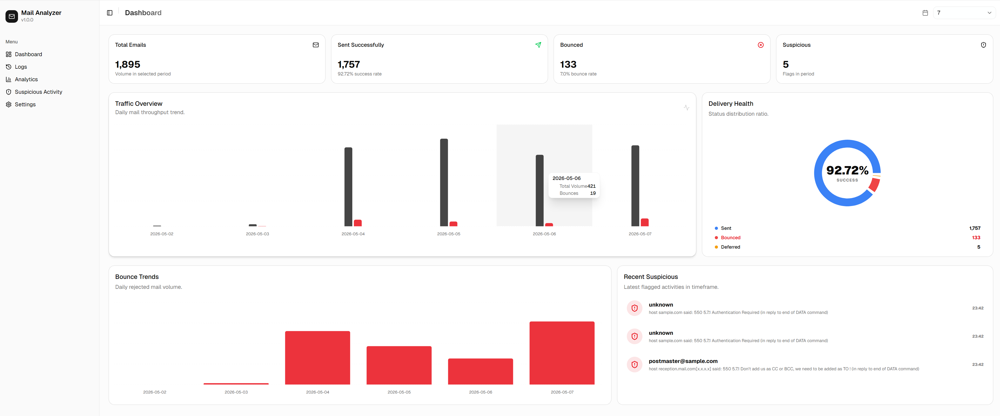

# Mail Log Analyzer

A high-performance Postfix mail log analysis system with a FastAPI backend and a Next.js 14 frontend.



## Features
- **Real-time Dashboard**: Overview of email volume, success rates, and bounces.
- **Log Correlation**: Robust parsing and correlation of Postfix logs (including rotated files).
- **Suspicious Activity Detection**: Automatically flags high-bounce senders and rejected messages.
- **Modern UI**: Built with Shadcn/UI, Recharts, and Framer Motion for a premium experience.

## Setup & Installation

### Backend (Python)
1. Navigate to the root directory.
2. Install dependencies:
   ```bash
   pip install -r backend/requirements.txt
   ```
3. Run the backend as a module:
   ```bash
   python -m backend.main
   ```
   *The API will be available at http://localhost:8001*

### Frontend (Next.js)
1. Navigate to the `frontend/` directory:
   ```bash
   cd frontend
   ```
2. Install dependencies:
   ```bash
   npm install
   ```
3. Run the development server:
   ```bash
   npm run dev
   ```
   *The UI will be available at http://localhost:3001*

## Project Structure
- `backend/`: FastAPI application, SQLAlchemy models, and Postfix log parser.
- `frontend/`: Next.js application with Shadcn/UI components.
- `logs/`: Directory where your Postfix `mail.log` files should be placed.
- `mail_analyzer.db`: SQLite database generated after processing logs.

## Troubleshooting
- **ModuleNotFoundError**: Ensure you have installed the requirements. If the error persists, try `pip install sqlalchemy fastapi uvicorn pydantic python-multipart python-dateutil`.
- **ImportError (Relative Imports)**: Always run the backend from the root directory using the `-m` flag: `python -m backend.main`.
